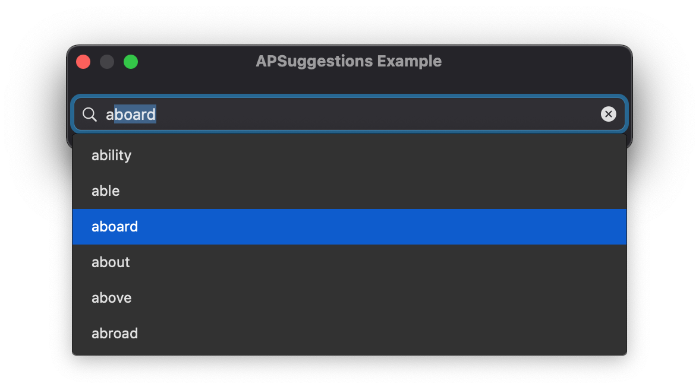

# APSuggestions
NSSearchfield Suggestions

## How to use?
#### If you want to use this, please give some credit

This is an example file 
It is easy to understand
https://github.com/Ashwin-Paudel/APSuggestions/blob/main/APSuggestions%20Example/APSuggestions%20Example/ViewController.swift

## Making a custom cell
in the `viewDidLoad` type `APsuggestionCellNib = "Your XIB File"`

Make sure your view in the XIB class is set to `APHighlightingView`

# More features yet to come...
